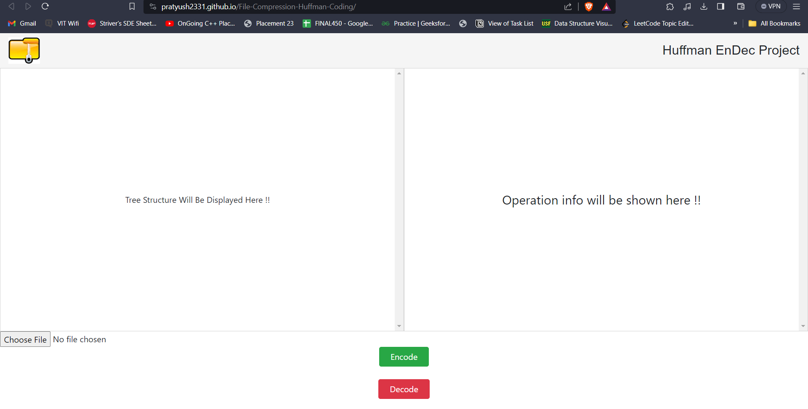

# Huffmann Coding

## [Live-Link](https://pratyush2331.github.io/File-Compression-Huffman-Coding/)

## Overview
Huffman Coding is a compression algorithm used to reduce the size of data files by efficiently encoding characters. It is widely used in applications where data compression is crucial, such as in file compression utilities and network protocols.

## Purpose
The purpose of this project is to implement Huffman Coding Algorithm in JavScript and front-end in HTML & CSS for educational and practical use. The algorithm assigns variable-length codes to input characters, with shorter codes given to more frequent characters. This allows for efficient compression and decompression of data.

## How Huffman Coding Works

1. **Frequency Analysis:** The algorithm begins by analyzing the frequency of each character in the input data.

2. **Build Huffman Tree:** A binary tree (Huffman Tree) is built based on the frequency of characters. Characters with higher frequencies are placed closer to the root of the tree.

3. **Generate Codes:** Traverse the Huffman Tree to generate variable-length codes for each character. Shorter codes are assigned to more frequent characters, ensuring efficient compression.

4. **Compression:** Replace the original characters with their corresponding Huffman codes to compress the data.

5. **Decompression:** Reconstruct the original data by traversing the Huffman Tree using the encoded data.

## Tech Stack Used : 
- HTML
- CSS
- JavaScript

> NOTE : 
> I built this as a part of project component 
> under Course name - Data Structures and Algorithms.